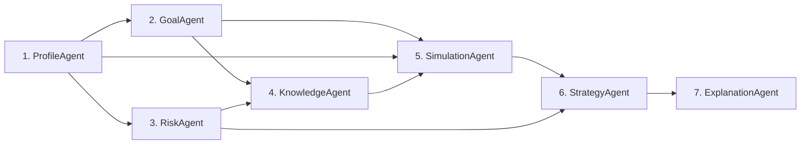

# FinPilot AI — Multi-Agent Architecture Specification 🤖

> **RMK INNOVATE Hackathon** | **Track:** Agentic & Generative AI  
> **Module:** 7-Agent Autonomous Planning Pipeline (`backend/services/agent_orchestrator.py`)

---

## Executive Overview

FinPilot AI implements a genuine multi-agent collaborative pipeline structured as a Directed Acyclic Graph (DAG). Rather than a single monolithic prompt, each agent possesses a distinct operational responsibility, bounded scope, specialized computational or retrieval tools, and an auditable execution trace logged to the database.



---

## 1. Agent Specifications

### 👤 1. ProfileAgent
- **Role:** Cash Flow & Capacity Verification Sentinel
- **Responsibility:** Ingests raw user financial data, calculates real monthly surplus, checks for capacity deficits, and validates whether stated savings are sustainable.
- **Inputs:**
  ```json
  {
    "age": 21,
    "monthly_income": 30000.0,
    "monthly_expenses": 20000.0,
    "current_savings": 50000.0,
    "monthly_investment_capacity": 5000.0
  }
  ```
- **Outputs:**
  ```json
  {
    "surplus": 10000.0,
    "validated_monthly_capacity": 5000.0,
    "savings_rate_pct": 33.3,
    "has_capacity_deficit": false,
    "flag": "HEALTHY_SURPLUS"
  }
  ```
- **Logic & Tools:** Computes $Surplus = Income - Expenses$. If stated investment capacity exceeds surplus, caps capacity to surplus and flags `CAPACITY_DEFICIT_WARNING`.
- **Evidence Produced:** Financial stage classification (e.g. *Early Career Foundation*).
- **Failure Behavior:** Falls back to standard 20% savings assumption if income or expense figures are invalid.

---

### 🎯 2. GoalAgent
- **Role:** Inflation & Horizon Calibration Specialist
- **Responsibility:** Validates target corpus feasibility, evaluates timeline length, and calculates future purchasing power target adjusted for inflation.
- **Inputs:**
  ```json
  {
    "target_corpus": 5000000.0,
    "horizon_years": 10,
    "goal_type": "Wealth Accumulation & Freedom",
    "inflation_rate": 0.06
  }
  ```
- **Outputs:**
  ```json
  {
    "goal_type": "Wealth Accumulation & Freedom",
    "target_amount_today": 5000000.0,
    "duration_years": 10,
    "inflation_rate_assumed": 0.06,
    "inflation_multiplier": 1.791,
    "inflation_adjusted_target": 8954238.0
  }
  ```
- **Logic & Tools:** Applies future value compounding formula:
  $$Target_{future} = Target_{today} \times (1 + r_{inf})^n$$
- **Evidence Produced:** Inflation erosion multiplier ($1.791\times$ over 10 years at 6%).
- **Failure Behavior:** Defaults to 6.0% long-term Indian retail CPI inflation and minimum 1-year horizon.

---

### ⚖️ 3. RiskAgent
- **Role:** Risk Capacity & Asset Allocation Architect
- **Responsibility:** Assesses stated risk tolerance against real risk capacity (emergency fund adequacy and horizon) to derive safe benchmark asset allocation.
- **Inputs:**
  ```json
  {
    "stated_risk": "moderate",
    "horizon_years": 10,
    "savings": 50000.0,
    "monthly_expenses": 20000.0
  }
  ```
- **Outputs:**
  ```json
  {
    "stated_risk_tolerance": "moderate",
    "effective_risk_profile": "moderate",
    "has_adequate_emergency_reserve": false,
    "emergency_buffer_months": 2.5,
    "recommended_emergency_buffer_months": 6.0,
    "target_asset_allocation": {
      "Equity": 65,
      "Debt": 20,
      "Cash/Liquid": 10,
      "Gold": 5
    }
  }
  ```
- **Logic & Tools:** Flags inadequate emergency reserves ($<3$ months of expenses) and forces a minimum 10% liquid cash allocation regardless of aggressive stated appetite.
- **Evidence Produced:** Asset allocation matrix based on NISM portfolio theory.
- **Failure Behavior:** Defaults to conservative 50:50 allocation if risk data is unparseable.

---

### 📖 4. KnowledgeAgent
- **Role:** Regulatory Evidence & Literature Specialist
- **Responsibility:** Queries the RAG knowledge base for authoritative literature matching the user's specific financial situation.
- **Inputs:**
  ```json
  {
    "goal_type": "Wealth Accumulation & Freedom",
    "horizon_years": 10,
    "risk_profile": "moderate"
  }
  ```
- **Outputs:**
  ```json
  {
    "evidence_count": 3,
    "citations": [
      {
        "title": "Power of Compounding & Systematic Investment Plans (SIP)",
        "source": "SEBI Investor Education Programme",
        "url": "https://investor.sebi.gov.in/educational-resources.html",
        "section": "Wealth Creation & Time Horizon"
      },
      {
        "title": "Asset Allocation: Equity, Debt, and Gold",
        "source": "Association of Mutual Funds in India (AMFI)",
        "url": "https://www.amfiindia.com/investor-corner/knowledge-center",
        "section": "Portfolio Construction"
      },
      {
        "title": "Goal-Based Reverse SIP & The 4% Safe Withdrawal Rule",
        "source": "FinPilot Financial Engineering Research",
        "url": "https://finpilot.ai/research/freedom-corpus",
        "section": "Financial Freedom Mathematics"
      }
    ]
  }
  ```
- **Logic & Tools:** Vector-space search across curated corpus of 8 regulatory documents.
- **Evidence Produced:** Formatted regulatory citations with provenance links.
- **Failure Behavior:** Supplies core SEBI Investor Charter citations as baseline evidence.

---

### 🔬 5. SimulationAgent
- **Role:** Deterministic Reverse SIP & Scenario Computational Engine
- **Responsibility:** Solves exact monthly SIP requirements using the mathematical reverse annuity formula across 3 standard market return scenarios (Conservative, Base, Optimistic).
- **Inputs:**
  ```json
  {
    "target_amount": 5000000.0,
    "horizon_years": 10,
    "current_savings": 50000.0,
    "monthly_capacity": 5000.0
  }
  ```
- **Outputs:**
  ```json
  {
    "base_case_required_sip": 21521,
    "base_case_contributed": 2582520,
    "base_case_growth": 2417480,
    "scenarios": {
      "conservative": { "annual_return_pct": 9.0, "required_monthly_sip": 25039 },
      "base": { "annual_return_pct": 12.0, "required_monthly_sip": 21521 },
      "optimistic": { "annual_return_pct": 15.0, "required_monthly_sip": 17218 }
    }
  }
  ```
- **Logic & Tools:** Executes `solve_reverse_sip`. Computes compounding of initial savings and annuity due.
- **Evidence Produced:** Exact rupee contribution vs compound growth split.
- **Failure Behavior:** Degrades to zero-return linear savings division if interest rates fail validation.

---

### 🧭 6. StrategyAgent
- **Role:** Action Roadmap & Capacity Gap Solver
- **Responsibility:** Formulates an actionable financial roadmap, calculates deficit between required SIP and user capacity, and suggests realistic mitigation strategies.
- **Inputs:** Outputs from `ProfileAgent`, `SimulationAgent`, and `RiskAgent`.
- **Outputs:**
  ```json
  {
    "recommended_monthly_sip": 21521,
    "available_capacity": 5000.0,
    "monthly_shortfall": 16521.0,
    "feasibility": "Requires Step-Up or Horizon Calibration",
    "action_plan": [
      "Capacity Shortfall: ₹16,521/month gap between current ₹5,000 capacity and required ₹21,521 SIP.",
      "Recommendation 1: Extend horizon from 10y to 15y to cut required SIP by ~55%.",
      "Recommendation 2: Adopt a 10% annual Step-Up SIP aligned with expected salary growth.",
      "Allocation Strategy: Deploy 65% in Nifty 50 Index Fund and 20% in Debt Instruments."
    ]
  }
  ```
- **Logic & Tools:** Gap analysis algorithm comparing investment capacity to required cash flows.
- **Evidence Produced:** Phased educational roadmap.
- **Failure Behavior:** Generates conservative debt-first safety plan.

---

### 🗣️ 7. ExplanationAgent
- **Role:** Transparent Pedagogical Communicator
- **Responsibility:** Translates raw financial metrics, gaps, and simulation numbers into an intuitive, jargon-free 6-part human explanation.
- **Inputs:** Outputs from all 6 upstream agents.
- **Outputs:** Structured 6-Part Explanation:
  1. **What:** Precise required SIP and target breakdown.
  2. **Why:** Reverse annuity mathematical justification.
  3. **Gap:** Transparent shortfall acknowledgment (₹16,521/mo gap).
  4. **Action:** Concrete step-up and horizon calibration strategies.
  5. **Evidence:** Direct citations from SEBI and AMFI literature.
  6. **Limitations:** Regulatory compliance notice regarding market volatility.

---

## 2. Execution Tracing & SQLite Audit Trail

Every invocation of `run_pipeline` produces an audit record stored in the `agent_runs` table:
```sql
CREATE TABLE agent_runs (
    id INTEGER PRIMARY KEY,
    run_id VARCHAR,
    user_id INTEGER,
    pipeline_status VARCHAR,
    agent_trace_json TEXT,
    created_at DATETIME
);
```

### Trace Object Structure:
```json
{
  "run_id": "run_042a850fe1f9",
  "status": "COMPLETED",
  "executed_agents_count": 7,
  "trace": [
    {
      "agent_name": "ProfileAgent",
      "status": "completed",
      "duration_ms": 0.37,
      "input_summary": "...",
      "output_summary": "...",
      "evidence": "Early Career Foundation"
    },
    ...
  ]
}
```

The frontend renders these execution traces directly as interactive agent status cards, demonstrating full operational transparency.
