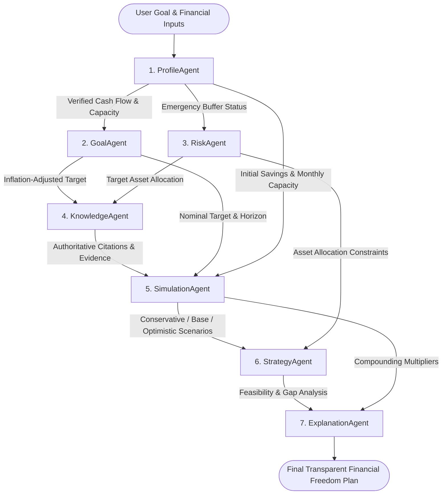

# FinPilot AI — System Architecture Document 🏛️

> **RMK INNOVATE Hackathon** | **Track:** Agentic & Generative AI  
> **System Name:** FinPilot AI Autonomous Wealth Mentorship Platform

---

## 1. Architectural Philosophy: The "Dual-Core" AI Model

Financial planning requires an uncompromising commitment to mathematical accuracy and regulatory compliance. LLMs are notoriously prone to numeric hallucinations and non-compliant investment promises when asked to perform compounding math directly.

FinPilot AI solves this fundamental challenge using a **Dual-Core Architecture**:
1. **The Deterministic Core (Financial Economics Engine):** All compound interest, reverse annuity due calculations, inflation compounding, tax computation, and portfolio drift metrics are executed by deterministic Python algorithms grounded in verified financial economics equations.
2. **The Generative & Agentic Core (7-Agent Orchestrator & RAG):** 7 specialized agents organize user goals, validate constraints, retrieve regulatory literature from SEBI/RBI/AMFI, formulate milestone strategies, and translate raw figures into transparent pedagogical explanations.

```
+-------------------------------------------------------------------------+
|                           User Request / UI                             |
+-------------------------------------------------------------------------+
                                    │
                                    ▼
+─────────────────────────────────────────────────────────────────────────+
|                        FastAPI Gateway Layer                            |
|             Authentication (JWT + bcrypt) | Rate Limiting               |
+─────────────────────────────────────────────────────────────────────────+
          │                                                  │
          ▼                                                  ▼
+───────────────────────────────────+     +───────────────────────────────+
|     7-Agent DAG Orchestrator      |     |     Grounded AI Tutor         |
|  1. ProfileAgent                  |     |  - Intent Analyzer            |
|  2. GoalAgent                     |     |  - Safety Guardrails          |
|  3. RiskAgent                     |     |  - Provider Abstraction       |
|  4. KnowledgeAgent                |     |    (Gemini / OpenAI / Grounded|
|  5. SimulationAgent               |     +───────────────────────────────+
|  6. StrategyAgent                 |                    │
|  7. ExplanationAgent              |                    │
+───────────────────────────────────+                    │
          │                                              │
          ├─────────────────────────┬────────────────────┘
          ▼                         ▼
+──────────────────────+   +──────────────────────────────────────────────+
|  Deterministic Engine|   |        RAG Knowledge Retrieval Engine        |
|  - Reverse SIP Solver|   |  - TF-IDF + BM25 Vector Space Model          |
|  - What-If Engine    |   |  - Curated Corpus: SEBI, RBI, AMFI, NISM     |
|  - Portfolio Drift   |   |  - Strict Provenance Citations               |
+──────────────────────+   +──────────────────────────────────────────────+
          │                                              │
          └─────────────────────────┬────────────────────┘
                                    │
                                    ▼
+─────────────────────────────────────────────────────────────────────────+
|                   Persistence & Audit Storage Layer                     |
|           SQLite Database: 15 Tables (Agent Runs, IQ Records)           |
+─────────────────────────────────────────────────────────────────────────+
```

---

## 2. 7-Agent Directed Acyclic Graph (DAG) Execution Flow

The planning engine executes as a strict Directed Acyclic Graph (DAG), ensuring that each agent receives strictly validated outputs from its upstream dependencies:



### Agent State Transition Matrix:
- **`INITIALIZED`** $\rightarrow$ Agent payload prepared with upstream inputs.
- **`RUNNING`** $\rightarrow$ Agent execution begins, timer started (`duration_ms` tracked).
- **`EVALUATED`** $\rightarrow$ Computational logic or RAG retrieval successfully completed.
- **`PERSISTED`** $\rightarrow$ Input summary, output summary, and evidence saved to `agent_runs` table in SQLite.
- **`COMPLETED`** $\rightarrow$ Output forwarded to downstream dependent agents.

---

## 3. Grounded RAG Knowledge Retrieval Pipeline

FinPilot AI implements a **Closed-Domain RAG Pipeline** designed specifically to eliminate hallucinations:
1. **Curated Regulatory Corpus:** Includes verified publications from the Securities and Exchange Board of India (SEBI), Reserve Bank of India (RBI), Association of Mutual Funds in India (AMFI), and National Institute of Securities Markets (NISM).
2. **Hybrid Tokenization:** Removes common stopwords, stems financial terms, and computes term-frequency inverse document frequency (TF-IDF) and BM25 keyword overlap scores.
3. **Citation Provenance:** Every retrieved passage retains metadata:
   - `doc_id`: Unique document identifier (e.g., `sebi_compounding_sip`)
   - `source`: Regulatory body or authoritative research source
   - `url`: Direct verification link to official regulatory resource
   - `section`: Specific chapter or section
4. **Context Injection:** When external LLMs (Gemini / OpenAI) are active, context is wrapped in strict bounding instructions:
   > *"Answer ONLY using facts present in the verified financial literature below. If a concept cannot be substantiated by the evidence, disclose the limitation."*

---

## 4. Frontend & Deployment Architecture

### Canonical Frontend (`index.html`)
FinPilot AI consolidates the user interface into a **single canonical React SPA** located at `index.html`:
- **In-Browser Babel Compilation:** Eliminates complex bundling toolchains; runs directly in modern browsers.
- **Zero Build Step:** Deployable instantly to Netlify or static object storage.
- **Micro-State React Architecture:** Decoupled states for `renderFinancialFreedomPlanner`, `renderPortfolioGuardian`, `renderFinancialIQ`, `renderTutor`, and `renderAdvisor`.
- **Responsive Theme Engine:** Modern dark/light design system with financial data formatting (Indian Rupee Lakh/Crore notation via `fmtINR`).

### Netlify Deployment Configuration (`netlify.toml`)
```toml
[build]
  publish = "."

[[redirects]]
  from = "/*"
  to = "/index.html"
  status = 200
```

---

## 5. Security Architecture

- **Stateless Authentication:** JSON Web Tokens (JWT) signed with HMAC-SHA256 (`HS256`).
- **Cryptographic Password Hashing:** Direct `bcrypt` hashing with salt rounds = 12.
- **Secret Isolation:** Environment variables loaded via `python-dotenv` from `.env`. Zero secrets committed to version control.
- **SEBI Non-Advisory Guardrails:** Explicit disclaimers embedded across all AI Tutor, Portfolio Guardian, and Multi-Agent outputs.

---

## 6. Database Entity Relationship (ER) Model

The SQLite database (`finpilot.db`) consists of 15 strongly typed relational tables managed by SQLAlchemy:
1. `users`: Core identity, password hash, paper cash balance, financial IQ score.
2. `user_profiles`: Professional status, age, dependants, financial stage.
3. `agent_runs`: Audit trail for every multi-agent pipeline run (run ID, agent name, timing, evidence).
4. `financial_iq_records`: Historical 6-pillar IQ evaluations.
5. `simulation_records`: Historical simulation runs (baseline vs what-if comparison).
6. `tutor_conversations`: Chat sessions with AI Financial Tutor.
7. `knowledge_documents`: Pre-seeded regulatory RAG corpus.
8. `quiz_attempts`: Itemized quiz responses and dimension metrics.
9. `goals`, `asset_holdings`, `portfolios`, `transactions`, `lessons`, `quizzes`, `lesson_completions`.
