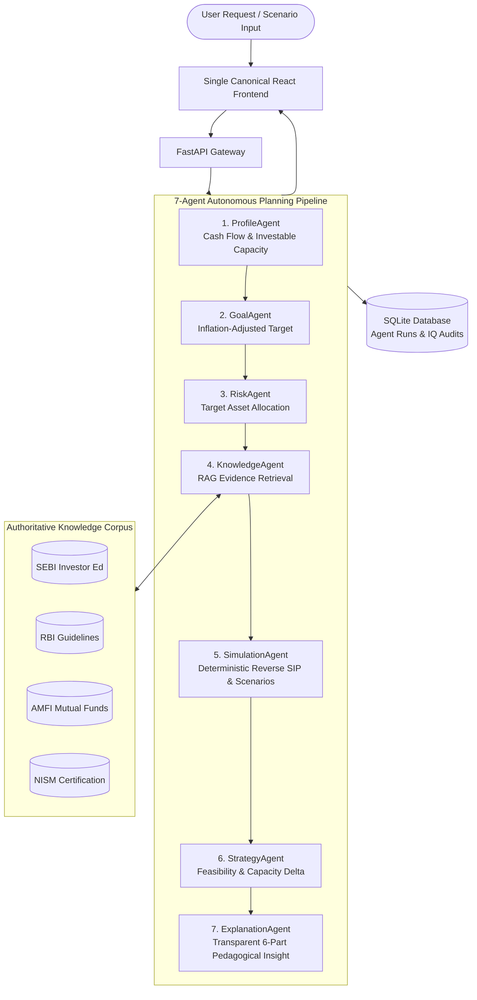

# FinPilot AI — Your Personal AI Wealth Mentor 🚀

> *"Achieving your financial freedom is our responsibility."*  
> **RMK INNOVATE Hackathon** | **Track:** Agentic & Generative AI

[](https://fastapi.tiangolo.com)
[](https://react.dev)
[](./AGENTS.md)
[](./RAG.md)
[-success)](./TESTING.md)

---

## 🎯 Executive Summary & Problem Statement

Retail personal finance and financial planning in India faces a dual crisis:
1. **The Financial Literacy Gap:** Over 76% of Indian adults do not understand fundamental financial concepts such as inflation drag, compounding frequency, emergency liquidity, or fund fee structures (TER).
2. **The "Guaranteed Return" Speculation Trap:** Unregulated social media fin-influencers and speculative platforms push volatile intraday tips and dubious penny stock schemes, causing severe capital destruction among young earners.
3. **The Opaque Advice Problem:** Commercial wealth management platforms push high-commission products without explaining the mathematical logic or trade-offs (e.g. 10y vs 15y timeline impact).

**FinPilot AI** solves this with an **education-first, multi-agent AI wealth mentorship ecosystem**. Instead of acting as an opaque black box, FinPilot AI combines:
- **A 7-Agent Directed Acyclic Graph (DAG) Orchestration Engine** with complete per-agent execution traces.
- **Authoritative Retrieval-Augmented Generation (RAG)** grounded strictly in curated regulatory literature from **SEBI, RBI, AMFI, and NISM**.
- **Deterministic Reverse SIP Mathematical Engine** with zero hallucination risk.
- **Interactive What-If Scenario Lab** (e.g., demonstrating that extending a timeline from 10 to 15 years cuts required monthly SIP by -55.1%).
- **Multi-Dimensional 6-Pillar Financial IQ Assessment Engine** (0–100 score mapped to a 1000-point framework).
- **Portfolio Guardian & Risk Sentinel** detecting asset allocation drift (+9% equity deviation) and fee drag without speculative rebalance triggers.

---

## 🏗️ Technical Architecture Highlights



---

## 🤖 The 7-Agent Planning Pipeline

| Agent | Responsibility | Core Logic / Mathematical Foundation |
| :--- | :--- | :--- |
| **1. ProfileAgent** | Validates user financial health | Inflow, mandatory living expenses, surplus, and safe investment capacity. |
| **2. GoalAgent** | Computes inflation-adjusted target | $Target_{future} = Target_{present} \times (1 + r_{inf})^n$. For ₹50L in 10y @ 6% inflation $\rightarrow$ ₹89.54 Lakh. |
| **3. RiskAgent** | Evaluates risk capacity vs tolerance | Determines target asset allocation (e.g. 70% Equity / 25% Debt / 5% Cash) and emergency reserve adequacy. |
| **4. KnowledgeAgent** | Retrieves verified regulatory evidence | Queries RAG knowledge base for authoritative citations (SEBI, RBI, AMFI, NISM). |
| **5. SimulationAgent** | Executes deterministic reverse SIP | Solves exact monthly contribution needed via reverse annuity due solver. |
| **6. StrategyAgent** | Calculates feasibility and deficit | Compares required SIP vs validated monthly capacity to formulate action roadmap. |
| **7. ExplanationAgent** | Pedagogical translation | Converts raw financial numbers into transparent, structured, multi-part human explanations. |

*Read the full agent specification in [`AGENTS.md`](./AGENTS.md).*

---

## 📚 Grounded RAG Knowledge Base

FinPilot AI’s RAG engine prevents hallucinations by querying a verified regulatory corpus:
- **SEBI Investor Education Programme:** Power of Compounding, SIP horizons, diversification principles.
- **Reserve Bank of India (RBI):** Inflation dynamics, real vs nominal return, emergency reserve safety.
- **Association of Mutual Funds in India (AMFI):** Expense ratio drag (TER), direct vs regular mutual funds.
- **National Institute of Securities Markets (NISM):** Equity vs debt asset allocation, behavioral finance biases.
- **Finance Act 2024:** Capital gains tax structures (12.5% LTCG, 20% STCG).

Every AI Tutor answer includes **verifiable citation metadata** (Source, URL, Document Title, and Section).

*Read the full RAG documentation in [`RAG.md`](./RAG.md).*

---

## 🚀 Flagship Demo User Journey

FinPilot AI is pre-configured with the flagship hackathon evaluation profile:
- **User:** Arjun Patel (Age 21, First-Job Software Engineer)
- **Financial Profile:** ₹30,000 Income | ₹20,000 Expenses | ₹50,000 Savings | ₹5,000 Monthly Capacity
- **Goal:** ₹50 Lakh Wealth Freedom Target
- **Baseline Horizon (10 Years @ 12% p.a.):** Required SIP is **₹21,521/month**. Shortfall = **-₹16,521/month**.
- **Interactive What-If Calibration (15 Years @ 12% p.a.):** Required SIP drops to **₹9,657/month** — an immediate **-₹11,864/month (-55.1%) drop**, making the goal realistically achievable via standard annual step-ups!
- **Portfolio Guardian:** Analyzes Arjun's starter portfolio: 79% Equity vs 70% Target $\rightarrow$ **+9% Equity Drift**, flagged as `MODERATE_DRIFT` with a zero-tax rebalancing recommendation via upcoming fresh SIP cash inflows.

*Follow the step-by-step judge walkthrough in [`DEMO.md`](./DEMO.md).*

---

## 🧪 Comprehensive Automated Test Suite

FinPilot AI includes a full test suite verifying all 9 core capabilities:
```bash
# Run the complete hackathon test suite
python3 backend/test_hackathon_suite.py
```

### Test Results (100% Pass Rate):
```
test_01_health_check: Verified root frontend serving and /api/health endpoint.
test_02_auth_signup_and_jwt: Verified bcrypt hashing, JWT issuance, and /api/auth/me.
test_03_rag_knowledge_base_retrieval: Verified TF-IDF retrieval against SEBI/RBI corpus with citations.
test_04_ai_tutor_and_safety_guardrails: Verified AI tutor answer structure and anti-speculation safety filter.
test_05_deterministic_reverse_sip_engine_and_edge_cases: Mathematical reverse SIP solver and edge cases verified.
test_06_whatif_timeline_engine: Verified 10y vs 15y timeline comparison produces ~55.1% SIP drop.
test_07_seven_agent_pipeline_and_db_logging: Verified full 7-agent DAG execution and DB persistence.
test_08_financial_iq_six_pillar_engine: Verified 6-pillar Financial IQ evaluation and questions API.
test_09_portfolio_guardian_allocation_drift: Verified +9% equity drift and rebalancing action plan.
----------------------------------------------------------------------
Ran 9 tests in 0.208s — OK (100% Passing)
```

*See full test details in [`TESTING.md`](./TESTING.md).*

---

## 💻 Local Quickstart

### Prerequisites
- Python 3.10+
- Node.js (optional, for Netlify preview)

### 1. Clone & Set Up Environment
```bash
git clone https://github.com/Hafruddin/FinPlot-Ai.git
cd FinPlot-Ai
python3 -m venv venv
source venv/bin/activate
pip install -r backend/requirements.txt
```

### 2. Configure Environment Variables
Copy `.env.example` to `.env`:
```bash
cp .env.example .env
```
*(Optional: add `GEMINI_API_KEY` or `OPENAI_API_KEY`. If omitted, FinPilot operates seamlessly on its high-accuracy deterministic grounded engine).*

### 3. Run the Server
```bash
python3 -m uvicorn backend.main:app --host 0.0.0.0 --port 8000 --reload
```

Open [http://localhost:8000](http://localhost:8000) in your browser.

---

## 📖 Complete Documentation Index

- [🏛️ System Architecture (`ARCHITECTURE.md`)](./ARCHITECTURE.md)
- [🤖 7-Agent Specification (`AGENTS.md`)](./AGENTS.md)
- [📚 RAG & Curated Corpus (`RAG.md`)](./RAG.md)
- [🔌 REST API Reference (`API.md`)](./API.md)
- [🧪 Automated Testing Suite (`TESTING.md`)](./TESTING.md)
- [🔒 Security & Compliance (`SECURITY.md`)](./SECURITY.md)
- [🎬 Judge Demonstration Script (`DEMO.md`)](./DEMO.md)
- [🏆 Final Hackathon Evaluation Report (`FINAL_EVALUATION.md`)](./FINAL_EVALUATION.md)

---

## ⚖️ Regulatory Disclaimer & Compliance Notice

FinPilot AI is an **educational financial intelligence and decision-support tool**. It is **not a SEBI-registered Investment Advisor (RIA)** or broker. FinPilot AI does not execute trades, manage customer funds, or guarantee investment returns. All projections and compounding calculations are illustrative and derived from standard financial economics equations.

---

## 👥 Contributors & Hackathon Team

Developed with pride for **RMK INNOVATE Hackathon**  
*Track: Agentic & Generative AI*  
Repository: [https://github.com/Hafruddin/FinPlot-Ai.git](https://github.com/Hafruddin/FinPlot-Ai.git)
