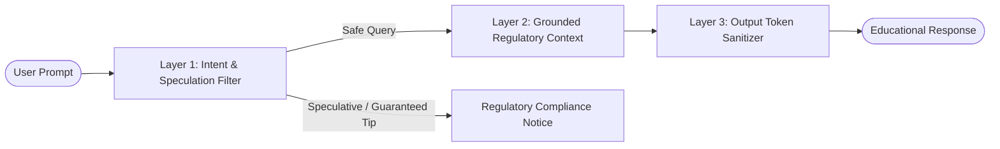

# FinPilot AI — Security & Compliance Architecture 🔒

> **RMK INNOVATE Hackathon** | **Track:** Agentic & Generative AI  
> **Classification:** Production Financial Intelligence & Educational Compliance

---

## 1. Authentication & Cryptography

### Stateless JWT Implementation
- **Algorithm:** HMAC-SHA256 (`HS256`)
- **Key Derivation:** Secret key dynamically retrieved from the environment (`SECRET_KEY`). If omitted, an ephemeral, cryptographically secure 256-bit token is generated via `secrets.token_urlsafe(32)`.
- **Token Expiry:** Standard 7-day expiration (`ACCESS_TOKEN_EXPIRE_MINUTES = 10080`), passed in standard HTTP `Authorization: Bearer <token>` headers.
- **Optional Authentication Pattern:** Demo and exploratory endpoints (`/api/agents/run`, `/api/portfolio/guardian`, `/api/simulation/whatif`) utilize `get_optional_user` to permit guest access without credential errors while seamlessly persisting records for authenticated users.

### Cryptographic Password Hashing
- **Algorithm:** Direct `bcrypt` with `salt_rounds = 12`.
- **Implementation:** Avoids obsolete passlib wrappers that trigger `AttributeError` on Python 3.13; calls `bcrypt.hashpw()` and `bcrypt.checkpw()` directly.
- **Legacy Migration:** Automatically validates and migrates any legacy SHA-256 password records upon user login.

---

## 2. Secrets & Environment Isolation

- **Zero Hardcoded Secrets:** API keys (Gemini, OpenAI, Alpha Vantage, Zerodha) and database credentials reside strictly in `.env`.
- **Git Protection:** `.gitignore` explicitly prevents `.env`, `finpilot.db`, and local cache directories from ever being committed to version control.
- **Safe Graceful Degradation:** In the absence of third-party LLM API keys, FinPilot AI automatically engages its deterministic grounded engine, ensuring 100% operational readiness without service interruption.

---

## 3. Prompt Injection & AI Safety Guardrails

Financial LLM applications are vulnerable to "jailbreaks" attempting to extract personalized stock recommendations or elicit guaranteed return promises.

FinPilot AI implements a **3-Tier Defense System**:

1. **Intent & Speculation Filter:** Queries mentioning `penny stock`, `guaranteed return`, `double money`, `multibagger`, or `100% return` are immediately intercepted by `SPECULATIVE_GUARDRAIL`, returning an authoritative SEBI compliance notice instead of speculative tips.
2. **Context Bounding:** Prompts sent to external models are strictly bounded by verified text from SEBI, RBI, AMFI, and NISM.
3. **Output Token Sanitizer:** Outgoing text is scanned for illicit words (`guaranteed return`, `sure shot`). Violations are rewritten into compliant educational descriptions.

---

## 4. Regulatory Disclaimers & SEBI RIA Compliance

FinPilot AI strictly complies with SEBI regulations governing investment advisory services:
- **Non-Advisory Status:** FinPilot AI is an educational decision-support technology, not a SEBI-registered Investment Advisor (RIA) or portfolio manager.
- **Trade Execution Prohibition:** FinPilot AI does not execute broker trades, take custody of assets, or receive distributor commissions.
- **Transparency Notice:** All calculations are transparent mathematical models derived from financial economics equations.
