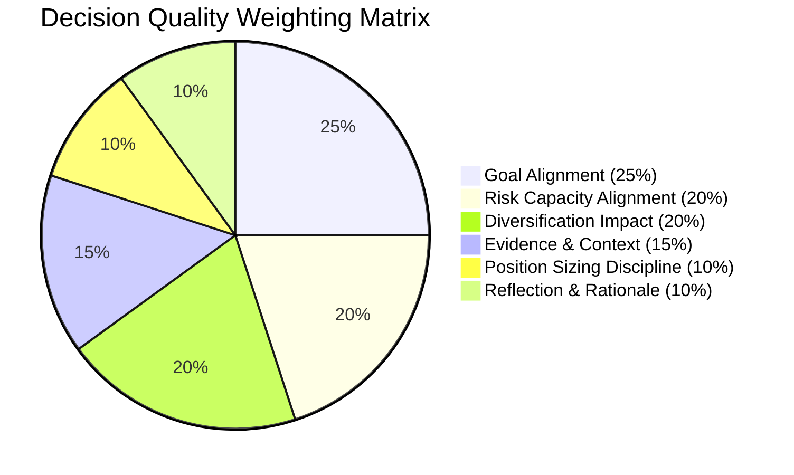

# FinPilot AI — Decision Quality Scoring Engine ⚖️

> **RMK INNOVATE Hackathon** | **Track:** Agentic & Generative AI  
> **Subsystem:** Multi-Factor Decision Quality Evaluator (`backend/services/decision_quality_service.py`)

---

## 1. The Core Philosophy: PROFIT ≠ FINANCIAL INTELLIGENCE

A central flaw in traditional paper-trading apps is rewarding pure rupee returns. If an amateur investor bets 95% of their net worth into an out-of-the-money options contract or an illiquid penny stock and happens to double their money due to luck, conventional platforms praise them as a genius.

In reality, **that decision carried catastrophic ruin probability**. Over a 20-year horizon, repeated reckless decisions guarantee bankruptcy.

**FinPilot AI enforces the opposite rule:**
- **Reckless Trade (High Profit):** Betting 80% on a single stock during extreme volatility gets a **FAILING Decision Quality Score ($\le 35/100$)**. The platform explains: *"High market gain achieved through high-risk speculation. Profit does not equal financial discipline."*
- **Prudent Trade (Drawdown):** Buying a high-quality bluechip with 10% position sizing, cash reserves intact, and a 10-year horizon receives an **EXCELLENT Decision Quality Score ($85+/100$)** even if the stock price drops 5% next week.

---

## 2. The 6-Pillar Decision Quality Formula

Every simulated investment decision is graded server-authoritatively across 6 weighted multi-factor pillars:

$$D = 0.25 \times \text{Goal} + 0.20 \times \text{Risk} + 0.20 \times \text{Div} + 0.15 \times \text{Evidence} + 0.10 \times \text{Sizing} + 0.10 \times \text{Reflection}$$

### Pillar Definitions:
1. **Goal Alignment (25%):** Does the trade horizon match the user's stated timeline? (e.g. Accumulating for a 10-year goal vs gambling with funds needed in 6 months).
2. **Risk Capacity Alignment (20%):** Does asset volatility match risk capacity? (e.g. Conservative profiles are penalized for >20% equity concentration).
3. **Diversification Impact (20%):** Does the decision maintain healthy diversification? Single-stock allocations $>35\%$ receive severe penalties.
4. **Evidence & Context (15%):** How does the user respond to market conditions? Panic selling at crash bottoms is penalized; disciplined DCA buying is rewarded.
5. **Position Sizing Discipline (10%):** Is capital allocation prudent? Prudent allocations (5%–15%) score $95/100$; all-in bets ($>50\%$) score $20/100$.
6. **Reflection & Rationale (10%):** Did the investor articulate a coherent thesis? Trades placed with zero documented reasoning are penalized to combat impulsive emotional bias.
