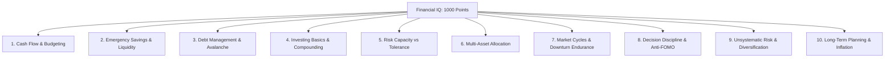

# FinPilot AI — 10-Dimension Financial IQ Architecture 🧠

> **RMK INNOVATE Hackathon** | **Track:** Agentic & Generative AI  
> **Subsystem:** Multi-Dimensional Assessment & Immutable Audit Ledger (`backend/services/financial_iq_service.py`)

---

## 1. Executive Summary

Financial intelligence is not a single scalar value. An investor may understand compounding mathematics exceptionally well while simultaneously panicking and liquidating equities during a 20% market dip. 

FinPilot AI decomposes Financial IQ into **10 distinct, verifiable competency dimensions**, evaluated on a 0–10 scale each (Total: 0–100 points, normalized to the **1000-point Financial IQ Scale**).



---

## 2. The 10 Competency Dimensions

| Dimension | Max Points | Core Skill Measured | Critical Mistake Penalized |
|:---|:---:|:---|:---|
| **1. Budgeting** | 10 pts (100 sc) | Cash flow surplus verification | Committing SIP > monthly surplus |
| **2. Saving** | 10 pts (100 sc) | 3–6 months liquid emergency buffer | Holding zero cash reserves |
| **3. Debt Management** | 10 pts (100 sc) | Eliminating high-interest revolving credit | Investing in equities while carrying 40% APR credit debt |
| **4. Investing Basics** | 10 pts (100 sc) | Compounding physics & direct mutual funds | Choosing high-commission regular funds unknowingly |
| **5. Risk Understanding** | 10 pts (100 sc) | Balancing risk capacity with horizon | Putting capital needed in 1 year into small caps |
| **6. Asset Allocation** | 10 pts (100 sc) | Multi-asset decorrelation (Equity/Debt/Gold) | 100% equity with no downside cushion |
| **7. Market Cycles** | 10 pts (100 sc) | Counter-cyclical discipline in crashes | Panic selling at market troughs |
| **8. Decision Discipline** | 10 pts (100 sc) | Resisting FOMO and emotional tips | Chasing hot momentum or penny stocks |
| **9. Diversification** | 10 pts (100 sc) | Spreading company & sector specific risk | >40% net worth concentrated in single company |
| **10. Long-Term Planning** | 10 pts (100 sc) | Adjusting targets for compound inflation | Assuming ₹1 Cr today equals ₹1 Cr in 15 years |

---

## 3. Server-Authoritative Immutable Audit Ledger

To prevent client manipulation and provide verifiable progress tracking, every Financial IQ modification is written to the SQLite `iq_activity_ledger` table:

```sql
CREATE TABLE iq_activity_ledger (
    id INTEGER PRIMARY KEY,
    user_id INTEGER NOT NULL,
    dimension VARCHAR NOT NULL,
    delta FLOAT NOT NULL,
    old_score FLOAT NOT NULL,
    new_score FLOAT NOT NULL,
    reason VARCHAR NOT NULL,
    evidence_json TEXT,
    created_at DATETIME
);
```

### Sample Audit Entry:
```json
{
  "id": 142,
  "user_id": 1,
  "dimension": "decision_discipline",
  "delta": 0.24,
  "old_score": 6.0,
  "new_score": 6.24,
  "reason": "Simulation March 2020 Covid Crash: BUY Decision Quality (84.0/100)",
  "evidence_json": "{\"pillars\": {\"goal_alignment\": 90, \"position_sizing\": 90}, \"reasoning\": \"Accumulating bluechip on panic drop\"}",
  "timestamp": "2026-09-22 10:40:56"
}
```
Client applications cannot directly modify IQ scores; they can only query `/api/iq/profile` or submit answers/orders to authoritative server evaluation endpoints.
